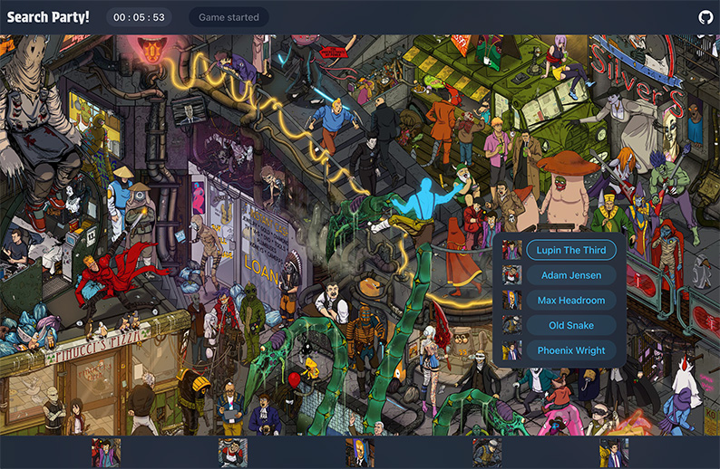

This photo-tag-backend project features:

- Typescript
- React SPA serving
- An Express-based RESTful API following a logical routing scheme
- CRUD operations with mongoose
- Body validation
- Rate limiting
- Profanity filter

This backend is to be used with my photo-tag-frontend repository. To use this app, clone photo-tag-frontend and build the app with 'npm run build', then place the resulting folder inside dist as "build". This backend will serve the React SPA
on the index route, then handle user input on the /api/ route to handle
supplying Waldos, guesses, wins, and the leaderboard.

